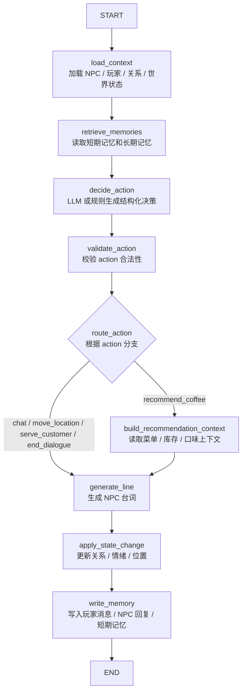

# Coffee NPC Agent 的 LangGraph 实战教程

本文以 `CoffeeNpcAgent` 为例，说明如何把原本串行执行的 NPC Agent 改造成基于 LangGraph 的状态图工作流。教程目标不是单纯介绍 LangGraph API，而是围绕一个真实游戏 NPC 场景，完成从现有 Agent 拆解、状态建模、节点设计、条件路由、工具接入到运行测试的完整实践。

适用对象：已经有基础 Agent、工具层、数据库服务层，并希望把 NPC 对话流程从“一个大函数”改造成“可观测、可扩展、可测试状态图”的开发者。

---

## 1. 为什么 Coffee NPC Agent 适合用 LangGraph 改造

原始 `CoffeeNpcAgent` 已经具备比较完整的 NPC 对话闭环：

1. 写入玩家消息。
2. 查询 NPC 状态、玩家画像、关系、历史对话、短期记忆、长期记忆、世界状态和咖啡厅事件。
3. 调用 LLM 生成结构化决策。
4. 校验 action 是否合法。
5. 如果是推荐咖啡，则补充推荐上下文。
6. 写入 NPC 回复。
7. 更新关系、状态和记忆。

这套逻辑可以工作，但当流程继续扩展时会出现几个问题：

第一，流程越来越长。一个 `handle_player_message` 里混合了上下文收集、决策、校验、动作分支、写库、记忆写入等逻辑，后续添加“查询库存”“触发事件”“多 NPC 插话”“玩家任务更新”等步骤时，主函数会越来越臃肿。

第二，分支不够清晰。`recommend_coffee`、`move_location`、`serve_customer`、`end_dialogue` 本质上应该走不同路径，但普通代码里通常通过多个 `if` 串起来，难以直观看出整个运行链路。

第三，不利于调试。Agent 出错时，需要手动判断是上下文不足、LLM 决策错误、动作校验失败，还是写入数据库失败。LangGraph 把每个阶段拆成节点后，可以更容易观察每个节点的输入、输出和状态变化。

第四，不利于扩展。游戏 NPC 后续通常会加入任务系统、事件系统、背包系统、世界规则系统、多 NPC 协作系统。用图结构后，可以按节点追加功能，而不是持续修改一个复杂函数。

LangGraph 的核心价值可以概括为一句话：把 Agent 的“隐式执行流程”显式建模为“状态 + 节点 + 边 + 条件路由”。

---

## 2. 改造前的 CoffeeNpcAgent 分层结构

当前项目中大致有三层：

```text
DirectorAgent
    ├── 负责场景入口
    ├── 管理 session
    ├── 选择当前 NPC
    └── 把玩家消息转发给 NpcAgent

NpcAgent
    ├── 处理单个 NPC 的一轮对话
    ├── 收集上下文
    ├── 决策
    ├── 校验 action
    ├── 生成/修正台词
    └── 写入对话、关系、状态和记忆

CoffeeNpcAgentTools
    ├── 封装数据库服务
    ├── 查询 NPC / 玩家 / 关系 / 世界状态
    ├── 写入对话
    ├── 读写短期和长期记忆
    ├── 查询咖啡知识和推荐上下文
    └── 校验动作是否合法
```

LangGraph 改造的重点不是替换工具层，也不是替换数据库层，而是替换 `NpcAgent.handle_player_message` 内部的流程组织方式。

改造后可以形成如下结构：

```text
DirectorAgent
    └── NpcGraphAgent
            ├── StateGraph 状态图
            ├── load_context 节点
            ├── retrieve_memories 节点
            ├── decide_action 节点
            ├── validate_action 节点
            ├── 条件路由 route_action
            ├── build_recommendation_context 节点
            ├── generate_line 节点
            ├── apply_state_change 节点
            └── write_memory 节点

CoffeeNpcAgentTools 保持不变
```

---

## 3. 一轮 NPC 对话的 LangGraph 流程图



这个图比原来的串行代码更清楚。每个节点只负责一类事情，节点之间通过共享状态传递结果。

---

## 4. 安装依赖

在项目虚拟环境中安装 LangGraph：

```bash
pip install langgraph
```

如果你还没有安装 LangChain Core，可以一并安装：

```bash
pip install langgraph langchain-core
```

如果项目中使用本地 Ollama 作为 LLM，需要确保你的 `LlmService.chat()` 已经能正常调用本地模型。LangGraph 不要求必须使用 OpenAI，它只负责工作流编排，LLM 可以是 OpenAI、Ollama、Qwen、DeepSeek、GLM 或你自己的封装。

---

## 5. 定义图状态 NpcGraphState

LangGraph 的状态可以理解为“这一轮 NPC 对话的共享上下文”。每个节点接收 state，并返回要更新的字段。

新建文件：

```text
agent/npc_graph_agent.py
```

先定义状态类型：

```python
from __future__ import annotations

import json
from typing import Any, Dict, List, Optional, TypedDict

from langgraph.graph import StateGraph, START, END


class NpcGraphState(TypedDict, total=False):
    # 本轮输入
    session_id: str
    player_id: str
    npc_id: str
    player_message: str

    # 外部依赖
    tools: Any
    llm_service: Any

    # 上下文
    npc_state: Dict[str, Any]
    player_profile: Dict[str, Any]
    relationship: Dict[str, Any]
    world_state: Dict[str, Any]
    short_term_memory: Dict[str, Any]
    long_term_memories: List[Dict[str, Any]]
    recommendation_context: Dict[str, Any]

    # 决策
    intent: str
    action: str
    decision: Dict[str, Any]
    action_allowed: bool
    action_error: Optional[str]

    # 回复与状态变化
    npc_reply: str
    relationship_delta: Dict[str, int]
    state_delta: Dict[str, Any]

    # 写入结果
    player_message_write_result: Dict[str, Any]
    npc_reply_write_result: Dict[str, Any]
    relationship_update_result: Dict[str, Any]
    memory_write_result: Dict[str, Any]

    # 错误
    errors: List[str]
```

状态字段不需要一次性全部存在。`total=False` 表示某些字段可以在后续节点中逐步补充。

设计状态时要注意两点。

第一，`tools` 和 `llm_service` 也放进 state。这样节点函数可以保持无类方法形式，方便单独测试。

第二，不要把过多无用数据塞进 LLM prompt。状态可以保存完整工具结果，但 `decide_action` 和 `generate_line` 节点中应该只挑必要字段给模型。

---

## 6. 节点一：load_context 加载基础上下文

`load_context` 负责读取 NPC 状态、玩家画像、关系和世界状态。

```python
def load_context(state: NpcGraphState) -> Dict[str, Any]:
    tools = state["tools"]
    errors = list(state.get("errors", []))

    npc_state = tools.invoke_tool("get_npc_state", {
        "npc_id": state["npc_id"],
    })

    player_profile = tools.invoke_tool("get_player_profile", {
        "player_id": state["player_id"],
    })

    relationship = tools.invoke_tool("get_relationship", {
        "player_id": state["player_id"],
        "npc_id": state["npc_id"],
    })

    world_state = tools.invoke_tool("get_world_state", {
        "session_id": state["session_id"],
    })

    for name, result in {
        "npc_state": npc_state,
        "player_profile": player_profile,
        "relationship": relationship,
        "world_state": world_state,
    }.items():
        if isinstance(result, dict) and not result.get("ok", True):
            errors.append(f"{name} 加载失败: {result.get('error')}")

    return {
        "npc_state": npc_state,
        "player_profile": player_profile,
        "relationship": relationship,
        "world_state": world_state,
        "errors": errors,
    }
```

这里要注意：你原本工具层的 `get_relationship` 参数是 `player_id` 和 `npc_id`，不是 `source_type/source_id/target_type/target_id`。如果图节点里传错参数，会触发工具参数错误。

---

## 7. 节点二：retrieve_memories 读取记忆

当前工具层提供的是 `get_short_term_memory` 和 `get_long_term_memories`。如果没有实现向量相似度检索接口，就先使用按重要性/时间返回的长期记忆。

```python
def retrieve_memories(state: NpcGraphState) -> Dict[str, Any]:
    tools = state["tools"]
    errors = list(state.get("errors", []))

    short_memory = tools.invoke_tool("get_short_term_memory", {
        "player_id": state["player_id"],
        "npc_id": state["npc_id"],
    })

    long_memory = tools.invoke_tool("get_long_term_memories", {
        "player_id": state["player_id"],
        "npc_id": state["npc_id"],
        "limit": 10,
    })

    if isinstance(short_memory, dict) and not short_memory.get("ok", True):
        errors.append(f"短期记忆读取失败: {short_memory.get('error')}")
    if isinstance(long_memory, dict) and not long_memory.get("ok", True):
        errors.append(f"长期记忆读取失败: {long_memory.get('error')}")

    return {
        "short_term_memory": short_memory,
        "long_term_memories": long_memory.get("memories", []) if isinstance(long_memory, dict) else [],
        "errors": errors,
    }
```

后续如果你接入 pgvector，可以新增 `search_long_term_memories` 工具，并把这里改成基于 `player_message` 做语义检索。

---

## 8. 节点三：decide_action 生成结构化决策

这个节点只做一件事：根据上下文生成结构化决策，不直接生成最终台词，也不写数据库。

```python
def decide_action(state: NpcGraphState) -> Dict[str, Any]:
    llm_service = state.get("llm_service")

    if llm_service is None:
        decision = rule_based_decision(state)
        return {
            "decision": decision,
            "intent": decision.get("intent", "small_talk"),
            "action": decision.get("action", "chat"),
        }

    prompt = f"""
你是咖啡厅 NPC 的决策模块。请只输出 JSON，不要输出 Markdown。

玩家输入：
{state["player_message"]}

NPC 状态：
{state.get("npc_state")}

玩家画像：
{state.get("player_profile")}

关系：
{state.get("relationship")}

世界状态：
{state.get("world_state")}

短期记忆：
{state.get("short_term_memory")}

长期记忆：
{state.get("long_term_memories")}

合法 action：
chat, recommend_coffee, ask_player, comment_on_npc, move_location, serve_customer, end_dialogue

输出 JSON 格式：
{{
  "intent": "small_talk",
  "action": "chat",
  "emotion": "calm",
  "line_goal": "根据当前上下文自然回复玩家",
  "relationship_delta": {{
    "trust": 0,
    "familiarity": 1,
    "fondness": 0,
    "dislike": 0,
    "stress": 0
  }},
  "state_delta": {{
    "npc_emotion": "calm",
    "npc_location": null
  }},
  "memory_tags": []
}}
"""

    try:
        response, _ = llm_service.chat(
            prompt=prompt,
            history=[],
            system_prompt="你是游戏 NPC 决策模块，只输出合法 JSON。",
        )
        decision = extract_json_object(response)
    except Exception:
        decision = rule_based_decision(state)

    decision = normalize_decision(decision)

    return {
        "decision": decision,
        "intent": decision.get("intent", "small_talk"),
        "action": decision.get("action", "chat"),
    }
```

配套工具函数：

```python
ALLOWED_ACTIONS = {
    "chat",
    "recommend_coffee",
    "ask_player",
    "comment_on_npc",
    "move_location",
    "serve_customer",
    "end_dialogue",
}

ALLOWED_EMOTIONS = {
    "neutral",
    "calm",
    "pleased",
    "happy",
    "curious",
    "worried",
    "annoyed",
    "sad",
    "angry",
    "tired",
}

RELATIONSHIP_FIELDS = {"trust", "familiarity", "fondness", "dislike", "stress"}


def extract_json_object(text: str) -> Dict[str, Any]:
    if not text:
        return {}
    text = text.strip()
    try:
        return json.loads(text)
    except json.JSONDecodeError:
        pass

    start = text.find("{")
    end = text.rfind("}")
    if start >= 0 and end > start:
        try:
            return json.loads(text[start:end + 1])
        except Exception:
            return {}
    return {}


def normalize_decision(decision: Dict[str, Any]) -> Dict[str, Any]:
    if not isinstance(decision, dict):
        decision = {}

    action = str(decision.get("action") or "chat")
    if action not in ALLOWED_ACTIONS:
        action = "chat"

    emotion = str(decision.get("emotion") or "neutral")
    if emotion not in ALLOWED_EMOTIONS:
        emotion = "neutral"

    raw_delta = decision.get("relationship_delta") or {}
    clean_delta: Dict[str, int] = {}
    for field in RELATIONSHIP_FIELDS:
        try:
            value = int(raw_delta.get(field, 0))
        except Exception:
            value = 0
        clean_delta[field] = max(-5, min(5, value))

    state_delta = decision.get("state_delta")
    if not isinstance(state_delta, dict):
        state_delta = {}

    memory_tags = decision.get("memory_tags")
    if not isinstance(memory_tags, list):
        memory_tags = []

    return {
        "intent": str(decision.get("intent") or "small_talk"),
        "action": action,
        "emotion": emotion,
        "line_goal": str(decision.get("line_goal") or "自然回应玩家"),
        "relationship_delta": clean_delta,
        "state_delta": state_delta,
        "memory_tags": memory_tags,
    }


def rule_based_decision(state: NpcGraphState) -> Dict[str, Any]:
    text = state.get("player_message", "").strip()

    if any(word in text for word in ["推荐", "咖啡", "喝什么", "菜单", "拿铁", "美式", "手冲"]):
        return normalize_decision({
            "intent": "ask_recommendation",
            "action": "recommend_coffee",
            "emotion": "pleased",
            "line_goal": "基于今日菜单和玩家偏好推荐咖啡",
            "relationship_delta": {
                "trust": 0,
                "familiarity": 1,
                "fondness": 1,
                "dislike": 0,
                "stress": 0,
            },
            "state_delta": {"npc_emotion": "pleased"},
            "memory_tags": ["coffee_preference"],
        })

    if any(word in text for word in ["再见", "拜拜", "下次见", "走了"]):
        return normalize_decision({
            "intent": "farewell",
            "action": "end_dialogue",
            "emotion": "calm",
            "line_goal": "自然结束对话",
            "relationship_delta": {
                "trust": 0,
                "familiarity": 1,
                "fondness": 0,
                "dislike": 0,
                "stress": 0,
            },
            "state_delta": {"npc_emotion": "calm"},
            "memory_tags": ["farewell"],
        })

    return normalize_decision({
        "intent": "small_talk",
        "action": "chat",
        "emotion": "calm",
        "line_goal": "自然闲聊并引导玩家继续表达",
        "relationship_delta": {
            "trust": 0,
            "familiarity": 1,
            "fondness": 0,
            "dislike": 0,
            "stress": 0,
        },
        "state_delta": {"npc_emotion": "calm"},
        "memory_tags": ["small_talk"],
    })
```

这里建议把“决策”和“台词生成”拆开。原因是动作分支需要先根据 `decision.action` 决定是否补充专用上下文，例如推荐咖啡前必须补充菜单、库存、咖啡知识和玩家口味。

---

## 9. 节点四：validate_action 校验动作合法性

LLM 输出的 action 不能直接执行，必须经过规则层。

```python
def validate_action(state: NpcGraphState) -> Dict[str, Any]:
    tools = state["tools"]
    decision = dict(state.get("decision", {}))
    action = decision.get("action", "chat")

    result = tools.invoke_tool("check_action_allowed", {
        "action": action,
        "npc_id": state["npc_id"],
        "target_location": decision.get("state_delta", {}).get("npc_location"),
    })

    if not result.get("ok") or not result.get("allowed", False):
        decision["action"] = result.get("fallback_action") or "chat"
        decision["line_goal"] = "动作不合法，降级为普通聊天回复。"
        decision.setdefault("state_delta", {}).pop("npc_location", None)

        return {
            "decision": decision,
            "action": decision["action"],
            "action_allowed": False,
            "action_error": result.get("error") or result.get("reason"),
        }

    return {
        "action_allowed": True,
        "action": action,
    }
```

这一步非常关键。游戏 Agent 不能让 LLM 直接改变世界状态，否则容易出现 NPC 瞬移到非法位置、非店员执行服务动作、推荐不存在的菜单等问题。

---

## 10. 条件路由：route_action

LangGraph 的条件边可以根据当前 state 选择下一步节点。

```python
def route_action(state: NpcGraphState) -> str:
    action = state.get("action", "chat")

    if action == "recommend_coffee":
        return "recommend_coffee"

    return "generate_line"
```

目前只把 `recommend_coffee` 单独分支，因为它需要额外查询推荐上下文。后续可以继续扩展：

```python
def route_action(state: NpcGraphState) -> str:
    action = state.get("action", "chat")

    if action == "recommend_coffee":
        return "recommend_coffee"
    if action == "move_location":
        return "move_location"
    if action == "serve_customer":
        return "serve_customer"
    if action == "end_dialogue":
        return "end_dialogue"

    return "generate_line"
```

在初版中不必过度拆分，否则节点数量会增加但收益不明显。实践中优先拆分“需要额外上下文或副作用明显”的动作。

---

## 11. 节点五：build_recommendation_context 构建推荐上下文

推荐咖啡不能只凭 LLM 常识，必须基于游戏内菜单、库存、玩家偏好和世界状态。

```python
def build_recommendation_context(state: NpcGraphState) -> Dict[str, Any]:
    tools = state["tools"]

    context = tools.invoke_tool("get_recommendation_context", {
        "player_id": state["player_id"],
        "npc_id": state["npc_id"],
        "session_id": state["session_id"],
    })

    return {
        "recommendation_context": context,
    }
```

这一步对应原始 `NpcAgent` 里 `decision.action == "recommend_coffee"` 后补查推荐上下文的逻辑。区别是现在它被显式建模为图中的一个节点。

---

## 12. 节点六：generate_line 生成 NPC 台词

`generate_line` 根据结构化决策生成最终台词。

```python
def generate_line(state: NpcGraphState) -> Dict[str, Any]:
    llm_service = state.get("llm_service")
    decision = state.get("decision", {})

    if llm_service is None:
        return {
            "npc_reply": rule_based_reply(state),
        }

    prompt = f"""
你正在扮演咖啡厅 NPC。请只输出 NPC 台词，不要输出 JSON。

NPC 信息：
{state.get("npc_state")}

玩家输入：
{state["player_message"]}

决策：
{decision}

世界状态：
{state.get("world_state")}

短期记忆：
{state.get("short_term_memory")}

长期记忆：
{state.get("long_term_memories")}

咖啡推荐上下文：
{state.get("recommendation_context")}

要求：
1. 只输出 NPC 对玩家说的话。
2. 不要输出 JSON。
3. 不要越权创造不存在的库存、菜单或事件。
4. 语气符合 NPC 性格。
5. 控制在 1 到 3 句话。
"""

    try:
        reply, _ = llm_service.chat(
            prompt=prompt,
            history=[],
            system_prompt="你是咖啡厅 NPC 台词生成模块。",
        )
        reply = reply.strip()
    except Exception:
        reply = rule_based_reply(state)

    if not reply:
        reply = rule_based_reply(state)

    return {"npc_reply": reply}


def rule_based_reply(state: NpcGraphState) -> str:
    action = state.get("action", "chat")
    decision = state.get("decision", {})

    if action == "recommend_coffee":
        rec = state.get("recommendation_context") or {}
        available_menu = rec.get("available_menu") or rec.get("result", {}).get("available_menu")
        if isinstance(available_menu, list) and available_menu:
            first = available_menu[0]
            name = first.get("name") if isinstance(first, dict) else str(first)
            return f"今天可以先试试{name}。如果你想要更甜一点或更清爽一点，我可以再帮你换一个选择。"
        return "今天菜单我还需要再确认一下。你想要偏甜、偏奶香，还是清爽一点的？"

    if action == "end_dialogue":
        return "那下次见。你再来店里的时候，我应该还在吧台这边。"

    emotion = decision.get("emotion", "calm")
    if emotion == "annoyed":
        return "我听到了。要是哪里不合口味，可以直接说具体一点，我会按店里的规矩处理。"

    return "嗯，我在听。今天店里还算安静，你想聊点什么？"
```

注意：原始草稿中 `generate_line` 里调用了 `self_rule_based_reply(state)`，但没有定义该函数。这里用 `rule_based_reply(state)` 补齐无 LLM 或 LLM 失败时的稳定降级路径。

---

## 13. 节点七：apply_state_change 应用关系和状态变化

这个节点负责把决策中的关系变化、NPC 情绪变化、NPC 位置变化写回数据库。

```python
def apply_state_change(state: NpcGraphState) -> Dict[str, Any]:
    tools = state["tools"]
    decision = state.get("decision", {})

    relationship_delta = decision.get("relationship_delta", {}) or {}
    state_delta = decision.get("state_delta", {}) or {}

    rel_result = tools.invoke_tool("apply_relationship_delta", {
        "player_id": state["player_id"],
        "npc_id": state["npc_id"],
        "delta": relationship_delta,
    })

    if state_delta.get("npc_emotion"):
        tools.invoke_tool("update_npc_emotion", {
            "npc_id": state["npc_id"],
            "emotion": state_delta["npc_emotion"],
        })

    if state_delta.get("npc_location"):
        tools.invoke_tool("move_npc_location", {
            "npc_id": state["npc_id"],
            "location": state_delta["npc_location"],
        })

    return {
        "relationship_update_result": rel_result,
        "relationship_delta": relationship_delta,
        "state_delta": state_delta,
    }
```

这里保持“LLM 只建议，工具层和规则层负责落库”的原则。即使 LLM 输出了关系变化，也要通过工具层统一写入，避免绕过校验。

---

## 14. 节点八：write_memory 写入对话和记忆

建议把“写入玩家消息”放在最后统一写，避免中途节点失败时只写入玩家消息却没有 NPC 回复。当然，如果你需要严格保存所有玩家输入，也可以把写入玩家消息放在最前面。这里采用统一写入方式。

```python
def write_memory(state: NpcGraphState) -> Dict[str, Any]:
    tools = state["tools"]

    player_write = tools.invoke_tool("write_player_message", {
        "session_id": state["session_id"],
        "player_id": state["player_id"],
        "npc_id": state["npc_id"],
        "content": state["player_message"],
    })

    npc_write = tools.invoke_tool("write_npc_reply", {
        "session_id": state["session_id"],
        "player_id": state["player_id"],
        "npc_id": state["npc_id"],
        "content": state["npc_reply"],
        "intent": state.get("intent"),
        "action": state.get("action"),
        "emotion": state.get("decision", {}).get("emotion"),
        "relationship_delta": state.get("relationship_delta", {}),
        "state_delta": state.get("state_delta", {}),
        "metadata_json": {
            "decision": state.get("decision", {}),
            "action_allowed": state.get("action_allowed"),
            "action_error": state.get("action_error"),
        },
    })

    memory_result = tools.invoke_tool("get_short_term_memory", {
        "player_id": state["player_id"],
        "npc_id": state["npc_id"],
    })

    return {
        "player_message_write_result": player_write,
        "npc_reply_write_result": npc_write,
        "memory_write_result": memory_result,
    }
```

如果你的 `MemoryService` 已经提供 `append_short_term_message` 工具，则可以把最后的 `get_short_term_memory` 替换成真正的追加短期记忆工具。当前 `CoffeeNpcAgentTools` 中没有暴露 `append_short_term_message`，所以本教程保持与现有工具层兼容。

---

## 15. 组装 LangGraph

```python
def build_npc_graph():
    graph = StateGraph(NpcGraphState)

    graph.add_node("load_context", load_context)
    graph.add_node("retrieve_memories", retrieve_memories)
    graph.add_node("decide_action", decide_action)
    graph.add_node("validate_action", validate_action)
    graph.add_node("build_recommendation_context", build_recommendation_context)
    graph.add_node("generate_line", generate_line)
    graph.add_node("apply_state_change", apply_state_change)
    graph.add_node("write_memory", write_memory)

    graph.add_edge(START, "load_context")
    graph.add_edge("load_context", "retrieve_memories")
    graph.add_edge("retrieve_memories", "decide_action")
    graph.add_edge("decide_action", "validate_action")

    graph.add_conditional_edges(
        "validate_action",
        route_action,
        {
            "recommend_coffee": "build_recommendation_context",
            "generate_line": "generate_line",
        },
    )

    graph.add_edge("build_recommendation_context", "generate_line")
    graph.add_edge("generate_line", "apply_state_change")
    graph.add_edge("apply_state_change", "write_memory")
    graph.add_edge("write_memory", END)

    return graph.compile()
```

LangGraph 的执行规则是：每个节点返回一个 dict，LangGraph 会把这个 dict 合并到当前 state 中，然后传给下一个节点。

---

## 16. 封装 NpcGraphAgent

```python
class NpcGraphAgent:
    def __init__(self, tools, llm_service=None):
        self.tools = tools
        self.llm_service = llm_service
        self.graph = build_npc_graph()

    def handle_message(
        self,
        session_id: str,
        player_id: str,
        npc_id: str,
        player_message: str,
    ) -> dict:
        if not session_id:
            return {"ok": False, "error": "缺少 session_id"}
        if not player_id:
            return {"ok": False, "error": "缺少 player_id"}
        if not npc_id:
            return {"ok": False, "error": "缺少 npc_id"}
        if not player_message or not player_message.strip():
            return {"ok": False, "error": "玩家消息不能为空"}

        state = {
            "session_id": session_id,
            "player_id": player_id,
            "npc_id": npc_id,
            "player_message": player_message.strip(),
            "tools": self.tools,
            "llm_service": self.llm_service,
            "errors": [],
        }

        result = self.graph.invoke(state)

        return {
            "ok": True,
            "session_id": session_id,
            "player_id": player_id,
            "npc_id": npc_id,
            "reply": result.get("npc_reply", ""),
            "intent": result.get("intent"),
            "action": result.get("action"),
            "decision": result.get("decision"),
            "relationship_delta": result.get("relationship_delta", {}),
            "state_delta": result.get("state_delta", {}),
            "action_allowed": result.get("action_allowed"),
            "action_error": result.get("action_error"),
            "errors": result.get("errors", []),
            "write_result": {
                "player_message": result.get("player_message_write_result"),
                "npc_reply": result.get("npc_reply_write_result"),
                "memory": result.get("memory_write_result"),
            },
        }
```

这就是对外可调用的图 Agent。它和原来的 `NpcAgent.handle_player_message()` 职责类似，但内部已经变成 LangGraph 状态图。

---

## 17. 完整可运行版本

下面给出一个合并后的 `agent/npc_graph_agent.py` 示例。可以直接复制到项目中，再根据你的实际包路径调整 import。

```python
from __future__ import annotations

import json
from typing import Any, Dict, List, Optional, TypedDict

from langgraph.graph import StateGraph, START, END


class NpcGraphState(TypedDict, total=False):
    session_id: str
    player_id: str
    npc_id: str
    player_message: str

    tools: Any
    llm_service: Any

    npc_state: Dict[str, Any]
    player_profile: Dict[str, Any]
    relationship: Dict[str, Any]
    world_state: Dict[str, Any]
    short_term_memory: Dict[str, Any]
    long_term_memories: List[Dict[str, Any]]
    recommendation_context: Dict[str, Any]

    intent: str
    action: str
    decision: Dict[str, Any]
    action_allowed: bool
    action_error: Optional[str]

    npc_reply: str
    relationship_delta: Dict[str, int]
    state_delta: Dict[str, Any]

    player_message_write_result: Dict[str, Any]
    npc_reply_write_result: Dict[str, Any]
    relationship_update_result: Dict[str, Any]
    memory_write_result: Dict[str, Any]
    errors: List[str]


ALLOWED_ACTIONS = {
    "chat",
    "recommend_coffee",
    "ask_player",
    "comment_on_npc",
    "move_location",
    "serve_customer",
    "end_dialogue",
}

ALLOWED_EMOTIONS = {
    "neutral",
    "calm",
    "pleased",
    "happy",
    "curious",
    "worried",
    "annoyed",
    "sad",
    "angry",
    "tired",
}

RELATIONSHIP_FIELDS = {"trust", "familiarity", "fondness", "dislike", "stress"}


def extract_json_object(text: str) -> Dict[str, Any]:
    if not text:
        return {}
    text = text.strip()
    try:
        return json.loads(text)
    except json.JSONDecodeError:
        pass

    start = text.find("{")
    end = text.rfind("}")
    if start >= 0 and end > start:
        try:
            return json.loads(text[start:end + 1])
        except Exception:
            return {}
    return {}


def normalize_decision(decision: Dict[str, Any]) -> Dict[str, Any]:
    if not isinstance(decision, dict):
        decision = {}

    action = str(decision.get("action") or "chat")
    if action not in ALLOWED_ACTIONS:
        action = "chat"

    emotion = str(decision.get("emotion") or "neutral")
    if emotion not in ALLOWED_EMOTIONS:
        emotion = "neutral"

    raw_delta = decision.get("relationship_delta") or {}
    clean_delta: Dict[str, int] = {}
    for field in RELATIONSHIP_FIELDS:
        try:
            value = int(raw_delta.get(field, 0))
        except Exception:
            value = 0
        clean_delta[field] = max(-5, min(5, value))

    state_delta = decision.get("state_delta")
    if not isinstance(state_delta, dict):
        state_delta = {}

    memory_tags = decision.get("memory_tags")
    if not isinstance(memory_tags, list):
        memory_tags = []

    return {
        "intent": str(decision.get("intent") or "small_talk"),
        "action": action,
        "emotion": emotion,
        "line_goal": str(decision.get("line_goal") or "自然回应玩家"),
        "relationship_delta": clean_delta,
        "state_delta": state_delta,
        "memory_tags": memory_tags,
    }


def rule_based_decision(state: NpcGraphState) -> Dict[str, Any]:
    text = state.get("player_message", "").strip()

    if any(word in text for word in ["推荐", "咖啡", "喝什么", "菜单", "拿铁", "美式", "手冲"]):
        return normalize_decision({
            "intent": "ask_recommendation",
            "action": "recommend_coffee",
            "emotion": "pleased",
            "line_goal": "基于今日菜单和玩家偏好推荐咖啡",
            "relationship_delta": {"trust": 0, "familiarity": 1, "fondness": 1, "dislike": 0, "stress": 0},
            "state_delta": {"npc_emotion": "pleased"},
            "memory_tags": ["coffee_preference"],
        })

    if any(word in text for word in ["再见", "拜拜", "下次见", "走了"]):
        return normalize_decision({
            "intent": "farewell",
            "action": "end_dialogue",
            "emotion": "calm",
            "line_goal": "自然结束对话",
            "relationship_delta": {"trust": 0, "familiarity": 1, "fondness": 0, "dislike": 0, "stress": 0},
            "state_delta": {"npc_emotion": "calm"},
            "memory_tags": ["farewell"],
        })

    return normalize_decision({
        "intent": "small_talk",
        "action": "chat",
        "emotion": "calm",
        "line_goal": "自然闲聊并引导玩家继续表达",
        "relationship_delta": {"trust": 0, "familiarity": 1, "fondness": 0, "dislike": 0, "stress": 0},
        "state_delta": {"npc_emotion": "calm"},
        "memory_tags": ["small_talk"],
    })


def rule_based_reply(state: NpcGraphState) -> str:
    action = state.get("action", "chat")
    decision = state.get("decision", {})

    if action == "recommend_coffee":
        rec = state.get("recommendation_context") or {}
        available_menu = rec.get("available_menu") or rec.get("result", {}).get("available_menu")
        if isinstance(available_menu, list) and available_menu:
            first = available_menu[0]
            name = first.get("name") if isinstance(first, dict) else str(first)
            return f"今天可以先试试{name}。如果你想要更甜一点或更清爽一点，我可以再帮你换一个选择。"
        return "今天菜单我还需要再确认一下。你想要偏甜、偏奶香，还是清爽一点的？"

    if action == "end_dialogue":
        return "那下次见。你再来店里的时候，我应该还在吧台这边。"

    if decision.get("emotion") == "annoyed":
        return "我听到了。要是哪里不合口味，可以直接说具体一点，我会按店里的规矩处理。"

    return "嗯，我在听。今天店里还算安静，你想聊点什么？"


def load_context(state: NpcGraphState) -> Dict[str, Any]:
    tools = state["tools"]
    errors = list(state.get("errors", []))

    npc_state = tools.invoke_tool("get_npc_state", {"npc_id": state["npc_id"]})
    player_profile = tools.invoke_tool("get_player_profile", {"player_id": state["player_id"]})
    relationship = tools.invoke_tool("get_relationship", {
        "player_id": state["player_id"],
        "npc_id": state["npc_id"],
    })
    world_state = tools.invoke_tool("get_world_state", {"session_id": state["session_id"]})

    for name, result in {
        "npc_state": npc_state,
        "player_profile": player_profile,
        "relationship": relationship,
        "world_state": world_state,
    }.items():
        if isinstance(result, dict) and not result.get("ok", True):
            errors.append(f"{name} 加载失败: {result.get('error')}")

    return {
        "npc_state": npc_state,
        "player_profile": player_profile,
        "relationship": relationship,
        "world_state": world_state,
        "errors": errors,
    }


def retrieve_memories(state: NpcGraphState) -> Dict[str, Any]:
    tools = state["tools"]
    errors = list(state.get("errors", []))

    short_memory = tools.invoke_tool("get_short_term_memory", {
        "player_id": state["player_id"],
        "npc_id": state["npc_id"],
    })
    long_memory = tools.invoke_tool("get_long_term_memories", {
        "player_id": state["player_id"],
        "npc_id": state["npc_id"],
        "limit": 10,
    })

    if isinstance(short_memory, dict) and not short_memory.get("ok", True):
        errors.append(f"短期记忆读取失败: {short_memory.get('error')}")
    if isinstance(long_memory, dict) and not long_memory.get("ok", True):
        errors.append(f"长期记忆读取失败: {long_memory.get('error')}")

    return {
        "short_term_memory": short_memory,
        "long_term_memories": long_memory.get("memories", []) if isinstance(long_memory, dict) else [],
        "errors": errors,
    }


def decide_action(state: NpcGraphState) -> Dict[str, Any]:
    llm_service = state.get("llm_service")

    if llm_service is None:
        decision = rule_based_decision(state)
        return {"decision": decision, "intent": decision["intent"], "action": decision["action"]}

    prompt = f"""
你是咖啡厅 NPC 的决策模块。请只输出 JSON，不要输出 Markdown。

玩家输入：
{state["player_message"]}

NPC 状态：
{state.get("npc_state")}

玩家画像：
{state.get("player_profile")}

关系：
{state.get("relationship")}

世界状态：
{state.get("world_state")}

短期记忆：
{state.get("short_term_memory")}

长期记忆：
{state.get("long_term_memories")}

合法 action：
chat, recommend_coffee, ask_player, comment_on_npc, move_location, serve_customer, end_dialogue

输出 JSON 格式：
{{
  "intent": "small_talk",
  "action": "chat",
  "emotion": "calm",
  "line_goal": "根据当前上下文自然回复玩家",
  "relationship_delta": {{"trust": 0, "familiarity": 1, "fondness": 0, "dislike": 0, "stress": 0}},
  "state_delta": {{"npc_emotion": "calm", "npc_location": null}},
  "memory_tags": []
}}
"""

    try:
        response, _ = llm_service.chat(
            prompt=prompt,
            history=[],
            system_prompt="你是游戏 NPC 决策模块，只输出合法 JSON。",
        )
        decision = extract_json_object(response)
    except Exception:
        decision = rule_based_decision(state)

    decision = normalize_decision(decision)
    return {"decision": decision, "intent": decision["intent"], "action": decision["action"]}


def validate_action(state: NpcGraphState) -> Dict[str, Any]:
    tools = state["tools"]
    decision = dict(state.get("decision", {}))
    action = decision.get("action", "chat")

    result = tools.invoke_tool("check_action_allowed", {
        "action": action,
        "npc_id": state["npc_id"],
        "target_location": decision.get("state_delta", {}).get("npc_location"),
    })

    if not result.get("ok") or not result.get("allowed", False):
        decision["action"] = result.get("fallback_action") or "chat"
        decision["line_goal"] = "动作不合法，降级为普通聊天回复。"
        decision.setdefault("state_delta", {}).pop("npc_location", None)
        return {
            "decision": decision,
            "action": decision["action"],
            "action_allowed": False,
            "action_error": result.get("error") or result.get("reason"),
        }

    return {"action_allowed": True, "action": action}


def route_action(state: NpcGraphState) -> str:
    if state.get("action") == "recommend_coffee":
        return "recommend_coffee"
    return "generate_line"


def build_recommendation_context(state: NpcGraphState) -> Dict[str, Any]:
    tools = state["tools"]
    context = tools.invoke_tool("get_recommendation_context", {
        "player_id": state["player_id"],
        "npc_id": state["npc_id"],
        "session_id": state["session_id"],
    })
    return {"recommendation_context": context}


def generate_line(state: NpcGraphState) -> Dict[str, Any]:
    llm_service = state.get("llm_service")
    decision = state.get("decision", {})

    if llm_service is None:
        return {"npc_reply": rule_based_reply(state)}

    prompt = f"""
你正在扮演咖啡厅 NPC。请只输出 NPC 台词，不要输出 JSON。

NPC 信息：
{state.get("npc_state")}

玩家输入：
{state["player_message"]}

决策：
{decision}

世界状态：
{state.get("world_state")}

短期记忆：
{state.get("short_term_memory")}

长期记忆：
{state.get("long_term_memories")}

咖啡推荐上下文：
{state.get("recommendation_context")}

要求：
1. 只输出 NPC 对玩家说的话。
2. 不要输出 JSON。
3. 不要越权创造不存在的库存、菜单或事件。
4. 语气符合 NPC 性格。
5. 控制在 1 到 3 句话。
"""

    try:
        reply, _ = llm_service.chat(
            prompt=prompt,
            history=[],
            system_prompt="你是咖啡厅 NPC 台词生成模块。",
        )
        reply = reply.strip()
    except Exception:
        reply = rule_based_reply(state)

    if not reply:
        reply = rule_based_reply(state)

    return {"npc_reply": reply}


def apply_state_change(state: NpcGraphState) -> Dict[str, Any]:
    tools = state["tools"]
    decision = state.get("decision", {})
    relationship_delta = decision.get("relationship_delta", {}) or {}
    state_delta = decision.get("state_delta", {}) or {}

    rel_result = tools.invoke_tool("apply_relationship_delta", {
        "player_id": state["player_id"],
        "npc_id": state["npc_id"],
        "delta": relationship_delta,
    })

    if state_delta.get("npc_emotion"):
        tools.invoke_tool("update_npc_emotion", {
            "npc_id": state["npc_id"],
            "emotion": state_delta["npc_emotion"],
        })

    if state_delta.get("npc_location"):
        tools.invoke_tool("move_npc_location", {
            "npc_id": state["npc_id"],
            "location": state_delta["npc_location"],
        })

    return {
        "relationship_update_result": rel_result,
        "relationship_delta": relationship_delta,
        "state_delta": state_delta,
    }


def write_memory(state: NpcGraphState) -> Dict[str, Any]:
    tools = state["tools"]

    player_write = tools.invoke_tool("write_player_message", {
        "session_id": state["session_id"],
        "player_id": state["player_id"],
        "npc_id": state["npc_id"],
        "content": state["player_message"],
    })

    npc_write = tools.invoke_tool("write_npc_reply", {
        "session_id": state["session_id"],
        "player_id": state["player_id"],
        "npc_id": state["npc_id"],
        "content": state["npc_reply"],
        "intent": state.get("intent"),
        "action": state.get("action"),
        "emotion": state.get("decision", {}).get("emotion"),
        "relationship_delta": state.get("relationship_delta", {}),
        "state_delta": state.get("state_delta", {}),
        "metadata_json": {
            "decision": state.get("decision", {}),
            "action_allowed": state.get("action_allowed"),
            "action_error": state.get("action_error"),
        },
    })

    memory_result = tools.invoke_tool("get_short_term_memory", {
        "player_id": state["player_id"],
        "npc_id": state["npc_id"],
    })

    return {
        "player_message_write_result": player_write,
        "npc_reply_write_result": npc_write,
        "memory_write_result": memory_result,
    }


def build_npc_graph():
    graph = StateGraph(NpcGraphState)

    graph.add_node("load_context", load_context)
    graph.add_node("retrieve_memories", retrieve_memories)
    graph.add_node("decide_action", decide_action)
    graph.add_node("validate_action", validate_action)
    graph.add_node("build_recommendation_context", build_recommendation_context)
    graph.add_node("generate_line", generate_line)
    graph.add_node("apply_state_change", apply_state_change)
    graph.add_node("write_memory", write_memory)

    graph.add_edge(START, "load_context")
    graph.add_edge("load_context", "retrieve_memories")
    graph.add_edge("retrieve_memories", "decide_action")
    graph.add_edge("decide_action", "validate_action")

    graph.add_conditional_edges(
        "validate_action",
        route_action,
        {
            "recommend_coffee": "build_recommendation_context",
            "generate_line": "generate_line",
        },
    )

    graph.add_edge("build_recommendation_context", "generate_line")
    graph.add_edge("generate_line", "apply_state_change")
    graph.add_edge("apply_state_change", "write_memory")
    graph.add_edge("write_memory", END)

    return graph.compile()


class NpcGraphAgent:
    def __init__(self, tools, llm_service=None):
        self.tools = tools
        self.llm_service = llm_service
        self.graph = build_npc_graph()

    def handle_message(
        self,
        session_id: str,
        player_id: str,
        npc_id: str,
        player_message: str,
    ) -> dict:
        if not session_id:
            return {"ok": False, "error": "缺少 session_id"}
        if not player_id:
            return {"ok": False, "error": "缺少 player_id"}
        if not npc_id:
            return {"ok": False, "error": "缺少 npc_id"}
        if not player_message or not player_message.strip():
            return {"ok": False, "error": "玩家消息不能为空"}

        state = {
            "session_id": session_id,
            "player_id": player_id,
            "npc_id": npc_id,
            "player_message": player_message.strip(),
            "tools": self.tools,
            "llm_service": self.llm_service,
            "errors": [],
        }

        result = self.graph.invoke(state)

        return {
            "ok": True,
            "session_id": session_id,
            "player_id": player_id,
            "npc_id": npc_id,
            "reply": result.get("npc_reply", ""),
            "intent": result.get("intent"),
            "action": result.get("action"),
            "decision": result.get("decision"),
            "relationship_delta": result.get("relationship_delta", {}),
            "state_delta": result.get("state_delta", {}),
            "action_allowed": result.get("action_allowed"),
            "action_error": result.get("action_error"),
            "errors": result.get("errors", []),
            "write_result": {
                "player_message": result.get("player_message_write_result"),
                "npc_reply": result.get("npc_reply_write_result"),
                "memory": result.get("memory_write_result"),
            },
        }
```

---

## 18. 与 DirectorAgent 集成

原来的 `DirectorAgent.talk()` 是这样把消息路由给 `NpcAgent` 的：

```python
npc_agent = self.get_npc_agent(target_npc_id)
return npc_agent.handle_player_message(
    player_id=player_id,
    session_id=session_id,
    content=message,
)
```

如果改成 LangGraph 版本，可以新增一个 `get_npc_graph_agent()`：

```python
from agent.npc_graph_agent import NpcGraphAgent

class DirectorAgent:
    def __init__(self, tools=None, llm=None, enable_web_search=False):
        self.tools = tools or CoffeeNpcAgentTools(enable_web_search=enable_web_search)
        self.llm = llm or LlmService.getLLM()
        self.sessions = {}
        self.npc_graph_agents = {}

    def get_npc_graph_agent(self, npc_id: str) -> NpcGraphAgent:
        if npc_id not in self.npc_graph_agents:
            self.npc_graph_agents[npc_id] = NpcGraphAgent(
                tools=self.tools,
                llm_service=self.llm,
            )
        return self.npc_graph_agents[npc_id]

    def talk(self, player_id: str, session_id: str, message: str, npc_id: str | None = None):
        target_npc_id = npc_id or self.get_selected_npc_id(session_id)
        if not target_npc_id:
            return {"ok": False, "error": "当前会话还没有选择 NPC，请先调用 select_npc"}

        if npc_id:
            self.select_npc(session_id=session_id, npc_id=npc_id)

        npc_agent = self.get_npc_graph_agent(target_npc_id)
        return npc_agent.handle_message(
            session_id=session_id,
            player_id=player_id,
            npc_id=target_npc_id,
            player_message=message,
        )
```

为了降低改造风险，可以先不要替换原 `NpcAgent`，而是在 `DirectorAgent` 中加一个开关：

```python
self.use_langgraph = True
```

然后在 `talk()` 中根据开关选择旧 Agent 或新 Graph Agent。

---

## 19. 最小测试脚本

新建：

```text
test_npc_graph_agent.py
```

示例：

```python
from agent.coffee_npc_agent_tools import CoffeeNpcAgentTools
from agent.llm_service import LlmService
from agent.npc_graph_agent import NpcGraphAgent


def main():
    tools = CoffeeNpcAgentTools(enable_web_search=False)
    llm = LlmService.getLLM()

    # 先进入场景，确保玩家、session、world_state 已创建
    scene = tools.invoke_tool("enter_morning_cafe", {
        "player_id": "p001",
        "nickname": "玩家",
        "session_id": "test_session_001",
    })
    print("SCENE:", scene)

    tools.invoke_tool("select_dialogue_npc", {
        "session_id": "test_session_001",
        "npc_id": "barista_001",
    })

    agent = NpcGraphAgent(tools=tools, llm_service=llm)

    result = agent.handle_message(
        session_id="test_session_001",
        player_id="p001",
        npc_id="barista_001",
        player_message="我想喝一杯不太甜的拿铁，有什么推荐？",
    )

    print("RESULT:", result)


if __name__ == "__main__":
    main()
```

运行：

```bash
python test_npc_graph_agent.py
```

期望输出中至少包含：

```text
ok: True
reply: NPC 回复文本
intent: ask_recommendation
action: recommend_coffee
decision: {...}
write_result: {...}
```

如果 `action` 是 `recommend_coffee`，说明条件路由已经进入了 `build_recommendation_context` 分支。

---

## 20. 如何调试每个节点

LangGraph 的一个优势是节点可以单独测试。比如测试 `route_action`：

```python
def test_route_action():
    assert route_action({"action": "recommend_coffee"}) == "recommend_coffee"
    assert route_action({"action": "chat"}) == "generate_line"
    assert route_action({}) == "generate_line"
```

测试 `normalize_decision`：

```python
def test_normalize_decision():
    decision = normalize_decision({
        "action": "fly_to_moon",
        "emotion": "super_happy",
        "relationship_delta": {"trust": 999},
    })

    assert decision["action"] == "chat"
    assert decision["emotion"] == "neutral"
    assert decision["relationship_delta"]["trust"] == 5
```

测试无 LLM 版本：

```python
def test_no_llm_agent(tools):
    agent = NpcGraphAgent(tools=tools, llm_service=None)
    result = agent.handle_message(
        session_id="test_session_001",
        player_id="p001",
        npc_id="barista_001",
        player_message="推荐一杯咖啡",
    )
    assert result["ok"] is True
    assert result["action"] == "recommend_coffee"
```

如果某一轮输出不符合预期，优先看四个字段：

```text
decision
action_allowed
action_error
errors
```

它们可以判断问题发生在 LLM 决策、动作校验、上下文加载还是工具层。

---

## 21. 常见错误与修正

### 21.1 get_relationship 参数错误

错误写法：

```python
tools.invoke_tool("get_relationship", {
    "source_type": "player",
    "source_id": player_id,
    "target_type": "npc",
    "target_id": npc_id,
})
```

当前工具层需要的是：

```python
tools.invoke_tool("get_relationship", {
    "player_id": player_id,
    "npc_id": npc_id,
})
```

### 21.2 search_long_term_memories 工具不存在

如果工具层没有注册 `search_long_term_memories`，则应先使用：

```python
tools.invoke_tool("get_long_term_memories", {
    "player_id": player_id,
    "npc_id": npc_id,
    "limit": 10,
})
```

等你完成 pgvector 检索接口后，再替换成语义检索。

### 21.3 self_rule_based_reply 未定义

错误写法：

```python
return {"npc_reply": self_rule_based_reply(state)}
```

应改成：

```python
return {"npc_reply": rule_based_reply(state)}
```

并在文件中定义 `rule_based_reply`。

### 21.4 重复写入玩家消息

如果你保留旧 `NpcAgent.handle_player_message()` 的逻辑，同时又在 Graph 的 `write_memory` 中写入玩家消息，就可能重复记录。迁移时需要明确只有一处负责写入。

推荐策略：

```text
旧 NpcAgent 路径：由旧 handle_player_message 写入。
新 NpcGraphAgent 路径：由 write_memory 节点写入。
DirectorAgent 不直接写入玩家消息。
```

### 21.5 LLM 输出非 JSON

`decide_action` 中要始终做 JSON 提取和 fallback。不要假设模型一定严格遵守格式。

推荐处理链路：

```text
LLM 输出
    -> extract_json_object
    -> normalize_decision
    -> validate_action
    -> route_action
```

---

## 22. 后续扩展方向

### 22.1 加入咖啡知识检索节点

如果玩家问的是咖啡知识，而不是点单推荐，可以新增节点：

```text
classify_question -> retrieve_coffee_knowledge -> generate_line
```

例如：

```python
def route_knowledge_needed(state):
    text = state.get("player_message", "")
    if any(word in text for word in ["咖啡豆", "烘焙", "萃取", "奶泡", "风味"]):
        return "retrieve_coffee_knowledge"
    return "decide_action"
```

### 22.2 加入任务系统节点

如果玩家接取任务，例如“帮店员找丢失的杯子”，可以加入：

```text
decide_action -> validate_action -> update_quest_state -> generate_line
```

任务系统不要直接交给 LLM 写库。LLM 可以输出任务意图，真正的任务状态更新仍由规则节点完成。

### 22.3 加入多 NPC 插话

当前 `DirectorAgent` 选择一个 NPC 对话。后续可以扩展为：

```text
select_speaker -> npc_graph_agent -> should_other_npc_react -> other_npc_graph_agent
```

例如玩家说“门口打架的人终于走了”，咖啡师可能回应，旁边的常客也可能插话。这个时候 LangGraph 可以把“是否触发其他 NPC 反应”建成条件节点。

### 22.4 加入异常恢复节点

可以把错误统一路由到 `fallback_reply`：

```text
load_context -> error_check -> fallback_reply / retrieve_memories
```

当数据库暂时不可用时，NPC 至少能给出一个不破坏角色设定的回复。

---

## 23. 推荐的最终项目结构

```text
CoffeeNpcAgent/
    agent/
        director_agent.py
        npc_agent.py
        npc_graph_agent.py
        coffee_npc_agent_tools.py
        llm.py
    db/
        db_config.py
        db_service.py
        db_init.py
    model/
        dialogue_model.py
        memory_model.py
        relationship_model.py
        world_model.py
    service/
        cafe_scene_service.py
        coffee_knowledge_service.py
        dialogue_service.py
        memory_service.py
        npc_service.py
        player_service.py
        relationship_service.py
        world_state_service.py
    test_npc_graph_agent.py
```

建议迁移顺序：

1. 保留旧 `NpcAgent`。
2. 新增 `NpcGraphAgent`。
3. 写一个最小测试脚本，只测 `barista_001`。
4. 确认上下文加载、推荐分支、写入对话正常。
5. 在 `DirectorAgent` 中加开关切换旧 Agent 和新 Graph Agent。
6. 再逐步把更多动作拆成独立节点。

---

## 24. 总结

用 LangGraph 改造 Coffee NPC Agent 的关键，不是把代码机械地包进图里，而是重新划分 Agent 的责任边界。

合理的拆分方式是：

```text
上下文加载节点：只负责读状态。
记忆检索节点：只负责读记忆。
决策节点：只负责生成结构化意图和动作。
校验节点：只负责规则约束。
条件路由：只负责选择执行路径。
专用上下文节点：只在需要时补充信息。
台词节点：只负责生成最终自然语言。
状态变更节点：只负责写关系、情绪、位置。
记忆节点：只负责记录本轮对话。
```

这样改造后，NPC Agent 的流程会更清晰，扩展也更稳定。后续无论是加入 pgvector 长期记忆检索、任务系统、多 NPC 插话，还是复杂世界事件，都可以通过增加节点和条件边完成，而不是继续堆叠一个越来越长的 `handle_player_message` 函数。
